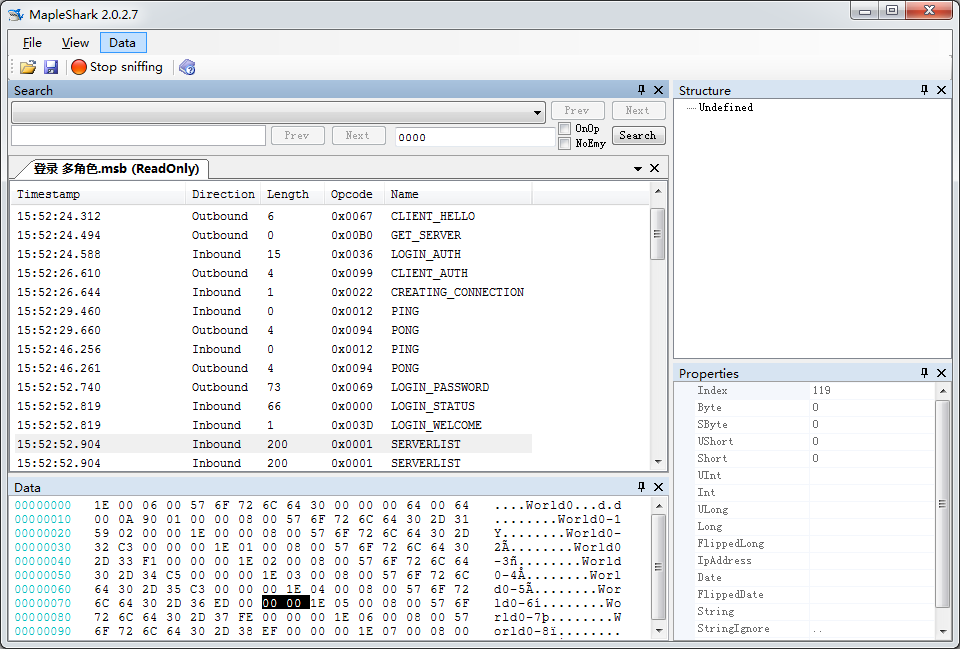

##  [MapleShark](https://git.oschina.net/zh3305/MapleShark-master)  [C#](https://git.oschina.net/languages/C%23) 


基于https://github.com/diamondo25/MapleShark

QQ群: 570489825

[TOC]



## **Operating Environment 运行环境**
+ .net framework 4.5 [Microsoft Download](https://www.microsoft.com/zh-cn/download/details.aspx?id=30653)
+ Visual Studio 2015

## **重要变化**

> 修改原有脚本引擎为 javascript引擎 最新版本 Jint(可选 NiL 在StructureForm.cs中启用) 通过VS自带NuGet工具管理和更新


> 新引擎和旧引擎脚本变化

- 不支持using (ScriptAPI) 操作, 需要注释掉


- 所有原来支持函数需带类名ScriptAPI(例 旧: AddShort("Packet Size"); 新: ScriptAPI.AddShort("Packet Size");)


- 新引擎支持所有javascript功能,全局和局部变量.


- JavaScript对";"不具有敏感性

## **功能使用说明**

> 版本Key的导入 只需要将key写入运行目录下的cached_keys.txt中即可,格式参照现有Key


> import Msniffer logfile功能已修正,可以直接打开Msniffer 保存的日志文件


> Import Java *.properties file 功能已修正,导入包头名称

- Propertise file:为选着要导入的包头名称文件
- MapleStory Locale ID: 为冒险岛  区域ID 中国为 4
- MapleStory  Version:为冒险岛版本ID 如 现版本 134
- Is Send opcode file :勾上及为Send包 包名文件如 sendops.properties
- 导入才能在Name中显示正确的包头名
- 导入的封包数据保存在版本目录下的 PacketDefinitions.xml 文件中

> 在运行目录下StkHeader.properties文件用于忽略封包(例PING=False)


## **Search 搜索**

- 上栏:   包头搜索
- 左下:   Hex 十六进制检索  *注:未实现 Prev(向上)检索功能*
- 右下:   正则表达式检索
    1. Regex : [正则表达式语法](https://msdn.microsoft.com/zh-cn/library/ae5bf541(v=vs.100).aspx)
    2. OnOp:  根据上栏选择的包头检索数据
    3. NoEmy: 检索文字是否包含空格. 勾选 {FFFFFFFF} 未勾选{FF FF FF FF}


## **Funitcon 函数**

> ScriptAPI


*函数前需添加类名ScriptAPI*

```javascript
byte 	AddByte(string name)  
long 	DAddByte()//读取Byte 不移动指针
sbyte 	AddSByte(string name)
ushort 	AddUShort(string name)
short 	AddShort(string name)
uint 	AddUInt(string name)
int 	AddInt(string name)
long 	DAddInt() //读取int 不移动指针
float 	AddFloat(string name)
double 	AddDouble(string name)
bool 	AddBool(string name)
long 	AddLong(string name)
double 	AddDouble(string name)
string 	AddPaddedString(string name, int length)//读取特定长度字符串
string 	AddString(string name)//读取字符串
void 	AddField(string name, int length)
void 	AddComment(string pComment)//添加空标记
void 	StartNode(string name).
void 	EndNode(bool expand)
void 	Write(string file, string line)
int 	Remaining()
void 	CWrite(string text) //输出到控制台
```


> mplew 


*函数前需添加类名mplew*  继承ScriptAPI


**标示颜色说明**

<font color=#FF0033 >#FF0033</font> 包头与默认值不匹配

<font color=#009933 >#009933</font> 包头与默认值相同

<font color=#FF6666 >#FF6666</font> 同名称标签值不同

<font color=#0099CC >#0099CC</font> 未检查包头

```c#
void    writeZeroBytes(int i)//输出指定个数的0
byte    write(string Name,params byte[] b)//输出一个byte
int     writeShort(string Name, params int[] b)
int     writeInt(string Name, params int[] b)
String  writeAsciiString(String Name,int length, params String[] b)
String  writeMapleAsciiString( String Name, params String[] b)
bool    writeBoolean(string Name)
void    writePos(string Name)//Point s
void    writeRect(string Name)
long    writeLong(String Name, params long[] b)
long    writeReversedLong(String Name, params long[] b)//反向操作未实现
long    writeReversedInt(String Name, params int[] b)//反向操作未实现
long    skip(int length)//跳过指定个数
byte[]  writeBuffer(String Name,int length))
public  byte[] writeBuffer(String Name, string HexString)//HexString 冒险岛hex String
```
